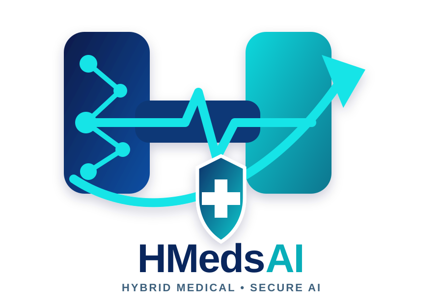

  

<h1 align="center">HMedsAI Lab</h1>

  <strong>Hybrid Medical and Secure Artificial Intelligence Laboratory</strong> 
  <em>Triggering Transformation through Trusted Medical AI</em>

  Led by <strong>Prof. Hari Mohan Rai</strong> 
  Department of Computer Science, School of Engineering and Digital Sciences 
  Nazarbayev University

---

## About HMedsAI Lab

HMedsAI Lab develops trustworthy, secure, and clinically meaningful artificial intelligence for medical imaging, biomedical signals, and intelligent healthcare systems. We bring together researchers and students working across artificial intelligence, deep learning, multimodal learning, privacy-preserving computation, and healthcare innovation.

## Research areas

- Medical imaging and computer-aided diagnosis
- Biomedical signal analysis
- Multimodal and generative artificial intelligence
- Federated and privacy-preserving learning
- Explainable, trustworthy, and secure AI
- Digital twins and intelligent healthcare systems
- Edge AI, Internet of Things, and cybersecurity

## Our approach

We connect methodological innovation with practical healthcare challenges through reproducible and responsible research. Our work emphasizes rigorous evaluation, explainability, privacy, security, and meaningful clinical impact.

## Collaboration

We welcome interdisciplinary collaboration with researchers, clinicians, students, and industry partners interested in trustworthy medical artificial intelligence.

## Contact

- **Laboratory lead:** [Prof. Hari Mohan Rai](https://github.com/harimohanrai)
- **Organization:** [github.com/HMedsAI-Lab](https://github.com/HMedsAI-Lab)

---

  <strong>HMedsAI Lab</strong> 
  <em>Triggering Transformation through Trusted Medical AI</em>

